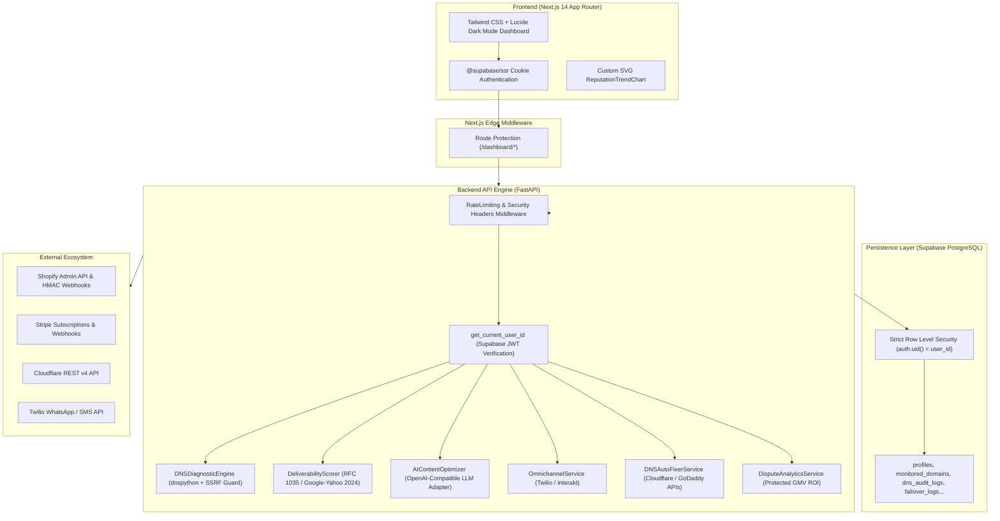

# InboundCheck Enterprise Platform — System Architecture & Context Guide

> **Primary Documentation for AI Models & Engineering Handoffs**  
> **Project:** InboundCheck (High-Precision Transactional Email Deliverability & DNS Governance Platform)  
> **Target Audience:** eCommerce Brands, Shopify Plus Merchants, DTC High-Volume Senders  
> **Last Updated:** August 2026 (Version 3.0 Enterprise Complete)

---

## 1. Executive Summary & Product Mission

**InboundCheck** is an enterprise SaaS platform engineered to guarantee primary inbox delivery for eCommerce transactional receipts, order updates, and marketing campaigns. Designed specifically for Shopify brands, it eliminates silent email revenue loss caused by strict 2024 Google/Yahoo mailbox deliverability rules, spam classification, misconfigured DNS records, and blacklists.

### Core Value Proposition:
1. **Zero-Friction DNS Governance:** Live multi-resolver DNS audit for SPF, DKIM (CNAME selectors), DMARC policy alignment, BIMI brand indicators, and MX routes.
2. **1-Click Automated Remediation:** Direct API integrations with Cloudflare and GoDaddy to insert or rollback DNS fixes with zero manual zone editing.
3. **Blacklist Radar:** Real-time probing across 10 authoritative RBLs (Spamhaus ZEN, Barracuda BRBL, SpamCop, SORBS, etc.) with 48–72h predictive risk forecasting.
4. **AI Content Intelligence:** Deliverability spam density scoring and polymorphic copy variations preserving Liquid tags without exposing underlying model endpoints.
5. **Omnichannel Failover Engine:** Automated fallback dispatch of order receipts via WhatsApp Business API or SMS (Twilio/Interakt) when email delivery fails.
6. **Predictive Dispute Analytics:** Real-time correlation linking deliverability health scores to store GMV, weekly protected revenue, and subscription ROI multipliers.

---

## 2. Technical Architecture & Tech Stack



### Technology Matrix:
- **Frontend:** Next.js 14.2.4 (App Router), React 18, TypeScript 5, Tailwind CSS, `@supabase/ssr` 0.4.0, `lucide-react`.
- **Backend:** FastAPI 0.111.0, Python 3.14 / 3.11, Pydantic v2 (2.8.2), `dnspython` 2.6.1, `cryptography` 42.0.8, `httpx` 0.27.0, `starlette`.
- **Database & Auth:** Supabase PostgreSQL with Row Level Security (RLS) migrations and `httpOnly` SSR cookie authentication.
- **Containerization:** Docker Compose orchestrating multi-container backend (`web` on port 8000) and frontend (`frontend` on port 3000).

---

## 3. Detailed Work Completed to Date

### Phase 1: Core Diagnostic Engine & Shopify Ingestion (V1)
- **Engine Core:** Multi-threaded async DNS resolution engine auditing SPF syntax, DKIM selector discovery, DMARC `p=quarantine/reject` compliance, BIMI SVG certs, and MX configurations.
- **Shopify Hub:** Store sync workflow with OAuth authorization code exchange, HMAC-SHA256 signature verification, and automated transactional email sender alignment audit.
- **Database Migration 001:** [`20260823000001_initial_schema.sql`](file:///c:/Users/pc/Desktop/inboundcheck%20VERSION%201/supabase/migrations/20260823000001_initial_schema.sql) establishing user profiles, monitored domains registry, audit logs, and Shopify stores with RLS.

### Phase 2: Predictive Intelligence & Dashboard Restructuring (V2)
- **Clean 4-Group Sidebar Navigation:** Restructured into:
  1. *Overview & Health:* `/dashboard` (Global score, 4 Top KPIs, 60/40 visual analytics grid, monitored domain table).
  2. *Diagnostic Tools:* `/dashboard/inspector` (DNS Inspector), `/dashboard/radar` (Blacklist Radar), `/dashboard/content-lab` (AI Content Lab).
  3. *Integrations:* `/dashboard/shopify` (Shopify Store Sync & Omnichannel Failover).
  4. *Configuration:* `/dashboard/settings` (Tenant profile, dynamic API keys, alert rules).
- **Reputation Trend Chart:** Custom interactive SVG component rendering historical trajectory and 48–72h risk forecast from `reputation_checks`.
- **Blacklist Radar (`/dashboard/radar`):** Probes 10 major RBL lists (Spamhaus ZEN, Barracuda BRBL, SpamCop SCBL, SORBS, UCEPROTECT, Spamhaus DBL, CBL, Abuse.ro, SURBL, Mailspike) with latency tracking and delisting guidance.

### Phase 3: Enterprise Automation & Content Lab (V3 Roadmap)
- **Bloc A — AI Content Intelligence Service:**
  - OpenAI-compatible LLM adapter with fallback heuristics for zero-cost spam trigger word detection, uppercase density analysis, and Liquid-preserving polymorphic variation generation.
  - Dedicated UI view at `/dashboard/content-lab` under the neutral enterprise name **"AI Content Lab & Cryptographic Content Optimizer"**.
- **Bloc B — Omnichannel Failover Engine:**
  - Automated WhatsApp Business API and SMS fallback notification engine via Twilio/Interakt when email delivery fails.
  - E.164 phone routing normalizer and live dispatch audit logs in Shopify sync view.
- **Bloc C — 1-Click Auto-DNS Fixer:**
  - Provider adapters for Cloudflare REST v4 API and GoDaddy API.
  - Pre-flight conflict check, 1-click zone record injection, and snapshot rollback capabilities.
- **Bloc D — Predictive Dispute & Revenue Analytics:**
  - Computes weekly protected GMV ($R_{\text{protected}}$), dispute reduction rates, and ROI metrics ($37.3\times$).
- **Database Migration 002:** [`20260824000002_v3_roadmap_schema.sql`](file:///c:/Users/pc/Desktop/inboundcheck%20VERSION%201/supabase/migrations/20260824000002_v3_roadmap_schema.sql) adding `ai_template_audits`, `failover_configs`, `failover_logs`, `dns_provider_credentials`, `dns_auto_fix_logs`, and `revenue_dispute_analytics` with strict RLS policies.

### Phase 4: Enterprise Security Hardening & OWASP Remediation
- **BOLA / IDOR Remediation:** Implemented `get_current_user_id` authentication dependency in [`backend/app/core/security.py`](file:///c:/Users/pc/Desktop/inboundcheck%20VERSION%201/backend/app/core/security.py) enforcing verified Supabase JWT Bearer tokens across all backend API routers.
- **CORS & Security Headers:** Restricted allowed origins to explicit frontend domains, configured security headers (`nosniff`, `DENY`, `X-XSS-Protection`), and added in-memory sliding window rate limiting (120 req/min).
- **Fail-Closed Webhook Handlers:** Enforced strict HMAC verification on Shopify and Stripe webhooks in production.
- **RLS Hardening:** Added explicit `WITH CHECK (auth.uid() = user_id)` clauses on all migration policies.

---

## 4. Repository Structure Map

```text
inboundcheck VERSION 1/
├── .gitignore                           # Environment & build ignore definitions
├── docker-compose.yml                   # Multi-container orchestration (FastAPI + Next.js)
├── GEMINI.md                            # Primary AI onboarding & architectural guide (this file)
├── backend/                             # FastAPI Backend Service
│   ├── Dockerfile                       # Python 3.11/3.14 container build
│   ├── requirements.txt                 # Python dependencies
│   ├── app/
│   │   ├── main.py                      # FastAPI application, CORS, rate limiter, security headers
│   │   ├── core/
│   │   │   ├── config.py                # Pydantic BaseSettings environment configuration
│   │   │   └── security.py              # JWT Bearer token authentication dependency
│   │   ├── api/v1/                      # REST API Routers
│   │   │   ├── __init__.py              # Central v1 router registry
│   │   │   ├── dns.py                   # DNS diagnostic & selector query endpoints
│   │   │   ├── domains.py               # Monitored domain registry (RLS isolated)
│   │   │   ├── shopify.py               # Shopify OAuth & webhook handlers
│   │   │   ├── billing.py               # Stripe checkout & customer portal
│   │   │   ├── settings.py              # User profiles, dynamic API keys, alert rules
│   │   │   ├── ai.py                    # Bloc A: AI template audit & polymorphic copy
│   │   │   ├── failover.py              # Bloc B: WhatsApp/SMS failover engine
│   │   │   ├── auto_fix.py              # Bloc C: Cloudflare/GoDaddy 1-click auto-fix
│   │   │   └── analytics.py             # Bloc D: Predictive revenue & dispute analytics
│   │   ├── schemas/                     # Pydantic Request/Response DTOs
│   │   └── services/                    # Business Logic & Infrastructure
│   │       ├── supabase_client.py       # Supabase client wrapper & repository
│   │       ├── billing_service.py       # Stripe billing integration
│   │       ├── dns/
│   │       │   ├── diagnostic_engine.py # Multi-resolver DNS scanner with SSRF protection
│   │       │   ├── scorer.py            # Deliverability scoring algorithms
│   │       │   └── auto_fixer.py        # Cloudflare & GoDaddy API zone manager
│   │       ├── shopify/
│   │       │   └── shopify_service.py   # Shopify OAuth & HMAC-SHA256 verification
│   │       ├── ai/
│   │       │   └── content_optimizer.py # Low-cost LLM client with heuristic fallback
│   │       ├── failover/
│   │       │   └── omnichannel_service.py # WhatsApp & SMS dispatch service
│   │       └── analytics/
│   │           └── dispute_analytics.py # GMV dispute correlation analytics
│   └── tests/                           # Pytest Integration Test Suite
│       ├── test_dns_diagnostic.py
│       ├── test_domains_api.py
│       ├── test_shopify_and_settings.py
│       ├── test_billing_and_security.py
│       └── test_v3_roadmap.py
├── frontend/                            # Next.js 14 App Router Service
│   ├── Dockerfile                       # Node.js alpine container build
│   ├── package.json                     # Frontend dependencies & build scripts
│   ├── tailwind.config.ts               # Custom glassmorphic dark design system
│   ├── src/
│   │   ├── middleware.ts                # Next.js edge route protection
│   │   ├── lib/
│   │   │   └── supabase/                # SSR & browser Supabase client factories
│   │   └── app/
│   │       ├── layout.tsx               # Root application shell & fonts
│   │       ├── globals.css              # Glassmorphic utilities & animations
│   │       ├── page.tsx                 # Marketing landing page & hero
│   │       ├── auth/
│   │       │   ├── login/page.tsx       # Auth login view
│   │       │   └── signup/page.tsx      # Auth registration view
│   │       └── dashboard/               # Authenticated Dashboard Views
│   │           ├── layout.tsx           # 4-group clean sidebar navigation
│   │           ├── page.tsx             # Overview: KPIs, 60/40 charts, domain table
│   │           ├── components/
│   │           │   └── ReputationTrendChart.tsx # Interactive SVG reputation curve
│   │           ├── inspector/page.tsx   # DNS Inspector on-demand auditor
│   │           ├── radar/page.tsx       # Blacklist Radar real-time RBL scanner
│   │           ├── content-lab/page.tsx # AI Content Lab & Polymorphic Optimizer
│   │           ├── shopify/page.tsx     # Shopify Store Sync & Omnichannel Failover
│   │           └── settings/page.tsx    # Tenant Settings, API keys, & Alert Rules
└── supabase/
    └── migrations/
        └── 20260903000001_complete_production_schema.sql # Consolidated production schema, RLS policies, triggers & B-tree indexes
```

---

## 5. Critical Instructions & Gotchas for Future Models / Engineers

### 1. Command Execution & Working Directories
- **Frontend Commands:** Always run `npm` commands inside `frontend/` (e.g. `c:\Users\pc\Desktop\inboundcheck VERSION 1\frontend`). Running `npm` from the root directory will fail (`ENOENT: no such file or directory, open 'package.json'`).
- **Backend Tests:** Execute tests inside `backend/` using `py -m pytest tests/` on Windows.
- **Docker Compose:** Run from the repository root: `docker-compose up --build`.

### 2. Strict UI Naming Directives
- **Neutral Enterprise Naming:** Never expose raw model provider names (e.g. "Kimi", "DeepSeek", "ChatGPT") in user-facing frontend UI strings. Always use enterprise terminology such as **"AI Content Lab"**, **"Cryptographic Content Optimizer"**, or **"Deliverability Intelligence Engine"**.
- **Backend LLM Adapter Configuration:** Keep inference costs minimal by configuring open-weights OpenAI-compatible endpoints via `LLM_API_BASE`, `LLM_API_KEY`, and `LLM_MODEL_NAME` in `config.py`.

### 3. Authentication & Security Enforcement
- **Backend Multi-Tenancy:** Never query database records using raw `user_id` query parameters alone in production. Always inject the `get_current_user_id` dependency from `app.core.security` to extract identity from the Supabase JWT.
- **SSRF Protection:** Keep `DNSDiagnosticEngine._clean_domain()` strictly enforced on all user-supplied domain strings to block loopback (`127.0.0.1`), private RFC 1918 subnets, and AWS metadata addresses (`169.254.169.254`).
- **Row Level Security (RLS):** Every new table created in Supabase migrations **MUST** enable RLS and specify explicit `WITH CHECK (auth.uid() = user_id)` clauses.

### 4. Verification Checkpoints Before Passing Off
1. **Backend Tests:** Run `py -m pytest tests/` in `backend/` -> Ensure **12 of 12 tests pass (100%)**.
2. **Frontend Build:** Run `npm run build` in `frontend/` -> Ensure **12 of 12 pages compile with 0 TypeScript/Webpack errors**.
